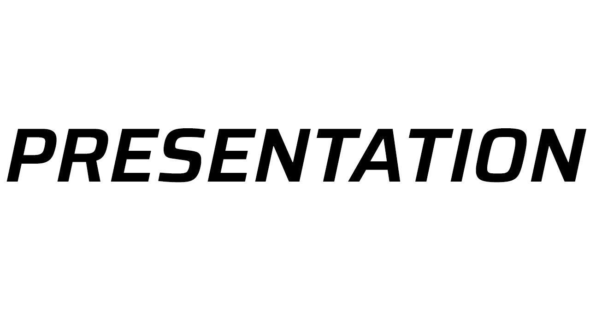
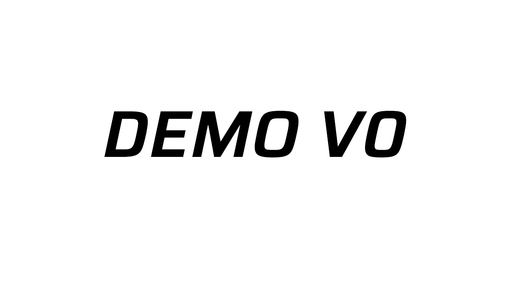

# Overwolf_Valorant_Caster_Overlay

## Video Presentation for Riot (Click on the image to redirect you to the video)

This app is still in development.

It's goal is to display the players stats for casters and for viewers of tournaments.

It's an overwolf app, which will be available on their store once it's ready :)

Here are some screenshots :

## DEMO v0 (Click on the image to redirect you to the video)
